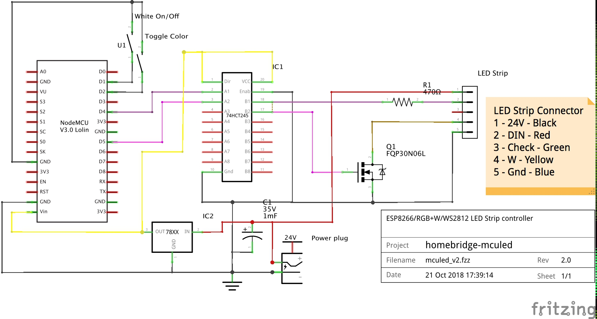
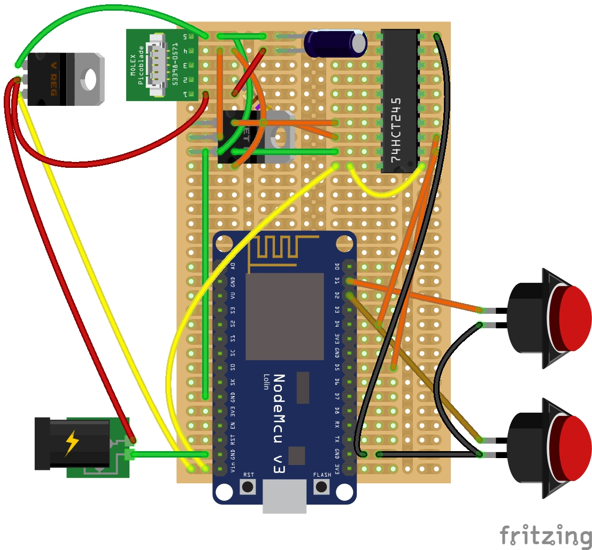

**homebridge-mculed** ESP8266 LUA Code

LUA programs for a nodeMCU device to control a RGB+W LED Strip

<!--ts-->
   * [Hardware](#hardware)
   * [Circuit Diagrams](#circuit-diagrams)
      * [Schematic](#schematic)
      * [Breadboard layout](#breadboard-layout)
      * [Perfboard layout](#perfboard-layout)
      * [Completed unit](#completed-unit)
   * [Tools](#tools)
   * [nodeMCU Firmware](#nodemcu-firmware)
   * [Configuration](#configuration)
   * [Provisioning and Running](#provisioning-and-running)
   * [ESPlorer Snippets](#esplorer-snippets)
      * [Memory](#memory)

<!-- Added by: sgracey, at:  -->

<!--te-->

# Hardware

1.  Bill of materials
    -   nodeMCU / esp8266 dev kit
    -   74HCT245
    -   1000uf 25V capacitor
    -   470 Ohm Resistor
    -   ~~DC to DC Power Converter~~
    -   78M05 Voltage Regulator
    -   2 x Push Button switch
    -   FQP30N06L N-Channel MOSFET
    -   Case - Hammond 1593NBK

# Circuit Diagrams

## Schematic

## Breadboard layout

## Actual Breadboard layout

## Unit 1 - layout

## Unit 1 - Completed unit

## Unit 2 - Completed unit

# Tools

-   nodeMCU-uploader - Install instructions are here <https://github.com/kmpm/nodeMCU-uploader>
-   lua - Install instructions are here <https://www.lua.org/download.html>
-   esptool - Install instructions are here <https://github.com/espressif/esptool>
-   esplorer - Install instructions are here <https://esp8266.ru/esplorer/>

# nodeMCU Firmware

1.  Using <http://nodeMCU-build.com>, create a custom firmware containing at least
    these modules:

    `bit,color_utils,crypto,file,gpio,mdns,net,node,pwm,sjson,tmr,uart,websocket,wifi,ws2812,ws2812_effects`


2.  Please use esptool to install the float firmware onto your nodeMCU.  There are alot of guides for this, so I won't repeat it here.


3.  Run the script lua/luaScript/initialUpload.sh, this will upload all the lua ota provisioning files to your esp8266

4.  Start esplorer, connect to the nodeMCU and run the following commands to get the device name

```
=wifi.sta.clearconfig()
=wifi.setmode(wifi.STATION,false)
=wifi.sta.gethostname()
```

This should return the nodeMCU name, i.e. NODE-AC4957

# Configuration

1.  WIFI Setup - Copy luaOTA/passwords_sample.lua to luaOTA/passwords.lua and add your wifi SSID and passwords.  Please note
    that the configuration supports multiple wifi networks, one per config line.


    module.SSID["SSID1"] = { ssid="SSID1", pwd = "password" }

2.  Copy config-NODE-AC545F.lua to your nodeMCU's name, and change the config to your model

```
    module.Model = "CLED"
```

3.  Copy ESP-NODE-AC545f.json to your nodeMCU's name, and update the file to include your config file.

# Provisioning and Running

1.  Start the OTA server with the script, startOtaServer.sh

2.  Using esplorer, on the nodeMCU, run the lua program initOta.lua

3.  After running, the nodeMCU will reboot a couple of times then the device should start running.

# ESPlorer Snippets

## Memory

```
    print("\n------- GLOBALS --------\n")

    for k,v in pairs(_G) do print(k,v) end

    print("\n-------- REGISTRY -------\n")

    for k,v in pairs(debug.getregistry()) do print(k,v) end

    print("\n------- PACKAGES --------\n")

    table.foreach (package.loaded, print)
```
