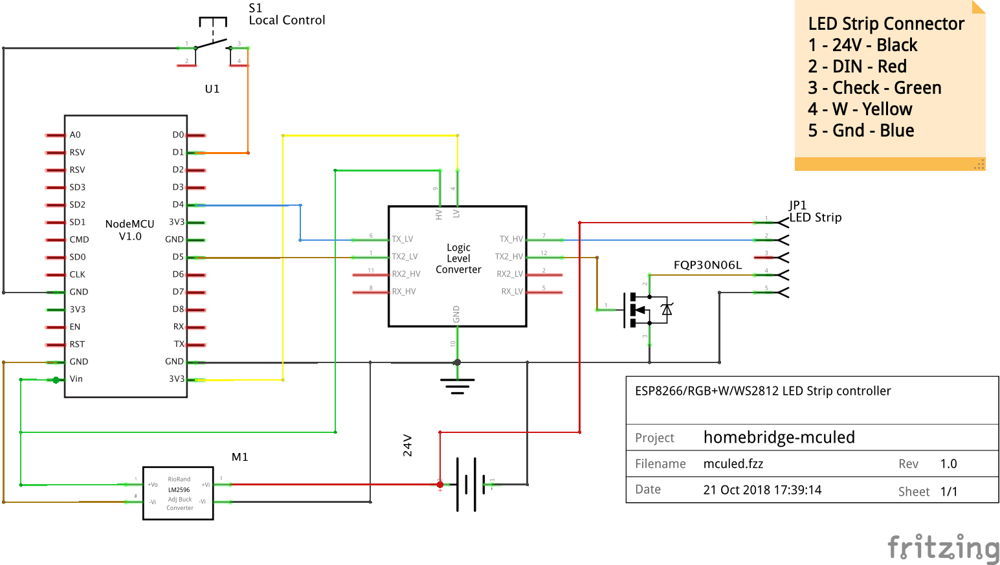

# homebridge-mculed ESP8266 LUA Code

LUA programs for a nodeMCU device to control a RGB+W LED Strip

# Hardware

1. Bill of materials
   - nodeMCU / esp8266 dev kit
   - Level Shifter
   - DC to DC Power Converter
   - Push Button switch
   - FQP30N06L N-Channel MOSFET

# Circuit Diagrams

## CLED/Costco LED Strip



# nodeMCU Firmware

1. Using http://nodemcu-build.com, create a custom firmware containing at least
   these modules:

   `bit,color_utils,crypto,file,gpio,mdns,net,node,pwm,sjson,tmr,uart,websocket,wifi,ws2812,ws2812_effects`


2. Please use esptool to install the float firmware onto your nodemcu.  There are alot of guides for this, so I won't repeat it here.

# Configuration

1. WIFI Setup - Copy passwords_sample.lua to passwords.lua and add your wifi SSID and passwords.  Please note
   that the configuration supports multiple wifi networks, one per config line.
```
module.SSID["SSID1"] = { ssid="SSID1", pwd = "password" }
```

2. Set your device Model in config.lua - Either DHT-MS,  BME-MS, BME-GD, or ACL used by homebridge-wssensor to determine which sensor type to create in homebridge

```
module.Model = "CLED"
or
module.Model = "BME-MS"
or
module.Model = "BME-GD"
or
module.Model = "ACL"
```

# Lua Program installation

1. I used nodemcu-uploader which is available here https://github.com/kmpm/nodemcu-uploader

2. Run the script upload.sh, this will upload all the lua files to your esp8266

3. Test your device by running test.lua

4. After you have completed testing, rename test.lua to init.lua

# ESPlorer Snippets

## Memory

```
print("\n------- GLOBALS --------\n")

for k,v in pairs(_G) do print(k,v) end

print("\n-------- REGISTRY -------\n")

for k,v in pairs(debug.getregistry()) do print(k,v) end

print("\n------- PACKAGES --------\n")

table.foreach (package.loaded, print)
```
